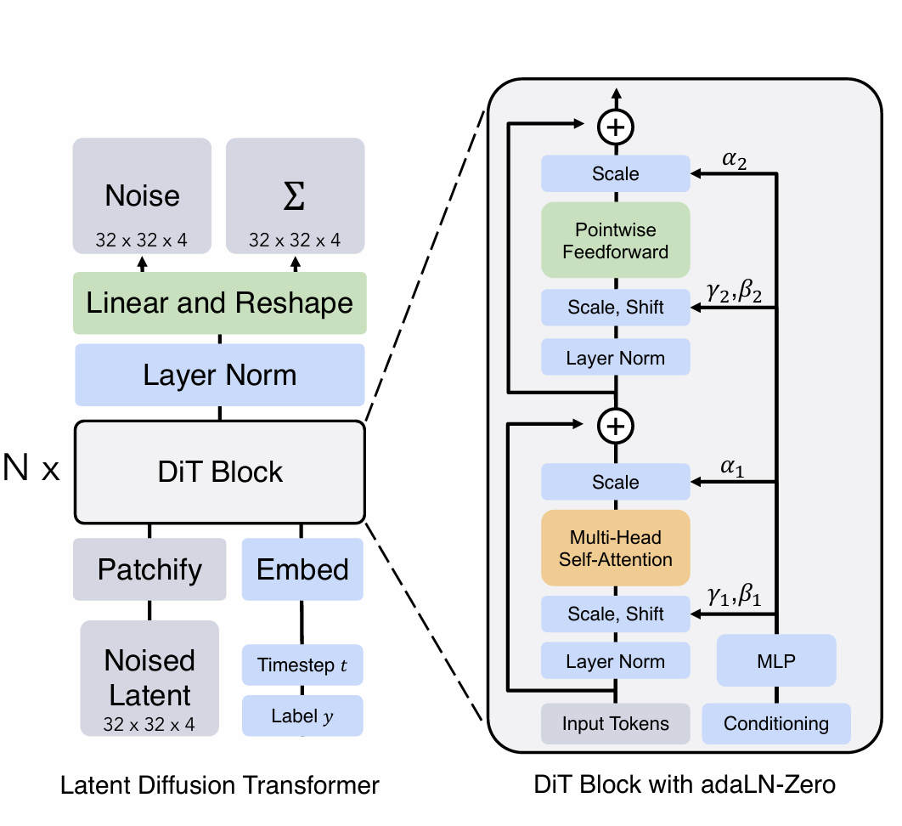

# oh-my-paper-figure-skill
作者: USTC 微电子学院 最闲的下饭菜/微院最强大的畜牲 ！！！！！
## 中文说明

`oh-my-paper-figure` 是一个用于复刻论文图、架构图、概念图、算法流程图和技术示意图的 Codex skill。它的目标不是把原图作为截图贴进 PPT，而是尽量用 PowerPoint 中可编辑的形状、线条、箭头、文本框、表格、公式标签和组合对象重新绘制。

生成结果通常适合继续在 PowerPoint 中手动微调、改文字、改颜色、改箭头和复用模块。

## 主要功能

- 将论文图复刻为可编辑 `.pptx` 文件。
- 支持模块框、箭头、连线、虚线、文本标签、公式、图例、表格和重复堆叠结构。
- 尽量匹配原图的结构、比例、配色、线宽、字体节奏和箭头语法。
- 支持两种模式：
  - `fast mode`：默认模式，更省时间和 token，适合快速复刻，重点保证主要结构和标签的高相似度。
  - `fine mode`：精细模式，会执行更严格的最终 PPTX 渲染检查，适合对完成度要求更高的图。

## 模型建议

为了获得最佳效果，优先推荐使用 **GPT-5.2 及以上模型**。

这个 skill 依赖模型理解图片、结构关系、文字布局、箭头连接和视觉比例，因此只能由具备多模态能力的模型有效使用。国产模型中，仅建议尝试 **Kimi 2.5 及以上多模态模型**；其他国产模型暂不推荐用于该 skill。

明确不推荐使用 **小米 Mimo 系列模型**。该系列模型在此类任务中表现极不稳定，可能无法理解自己绘制的图形内容，还可能误删用户文件；用于本 skill 风险很高，不建议尝试。

## 目录结构

```text
oh-my-paper-figure-skill/
├── README.md
├── oh-my-paper-figure/
│   ├── SKILL.md
│   ├── agents/
│   │   └── openai.yaml
│   └── references/
│       ├── figure-polish-modes.md
│       └── ppt-figure-workflow.md
├── 原图.png
└── 所有矢量图形可编辑效果图.png
```

## 示例提示词

```text
使用 oh-my-paper-figure skill，实现 PPT 画这张 xxx 论文图。
```

```text
使用 oh-my-paper-figure skill，实现 PPT 画这个论文图：https://example.com/paper-figure.png
```

```text
使用 oh-my-paper-figure skill，fine mode，把这张架构图复刻成可编辑 PPT，并进行最终 PPTX 渲染检查。
```

## 效果展示

原图：



所有矢量图形可编辑效果图：


## English

`oh-my-paper-figure` is a Codex skill for recreating academic paper figures, architecture diagrams, concept diagrams, algorithm flowcharts, and technical schematics as editable PowerPoint diagrams.

The goal is not to paste the source image as a flat screenshot. Instead, the skill guides Codex to rebuild the figure with editable PowerPoint objects such as shapes, arrows, lines, text boxes, tables, formula labels, legends, and grouped repeated motifs.

## Features

- Recreates paper figures as editable `.pptx` files.
- Supports module boxes, arrows, lines, dashed paths, text labels, equations, legends, tables, and repeated stacked structures.
- Tries to match the source figure's structure, proportions, colors, line weights, typography rhythm, and arrow grammar.
- Supports two modes:
  - `fast mode`: the default mode, optimized for lower time and token cost while preserving strong visual fidelity.
  - `fine mode`: a stricter mode with final-PPTX render-and-compare QA for higher completion quality.

## Model Recommendations

For best results, use **GPT-5.2 or later**.

This skill requires multimodal capability because the model must understand the source image, layout relationships, text placement, arrow connections, and visual proportions. Among Chinese domestic models, only **Kimi 2.5 or later multimodal models** are suggested for experimentation. Other domestic models are not recommended for this skill.

The **Xiaomi Mimo series** is explicitly not recommended. In this workflow it can be highly unstable, may fail to understand the diagram it is drawing, and may even delete user files by mistake. Using it with this skill is strongly discouraged.

## Example Prompts

```text
Use the oh-my-paper-figure skill to recreate this paper figure as an editable PowerPoint diagram.
```

```text
Use the oh-my-paper-figure skill to draw this paper figure in PPT: https://example.com/paper-figure.png
```

```text
Use the oh-my-paper-figure skill in fine mode to recreate this architecture diagram as an editable PPTX and perform final PPTX render QA.
```
